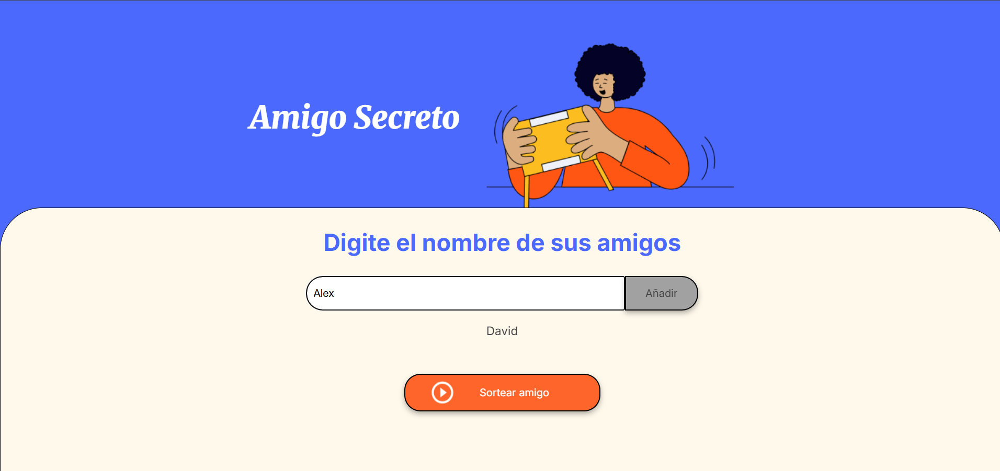

# Amigo Secreto

## Descripción  
Este proyecto es una aplicación sencilla para realizar un sorteo de amigo secreto.  
Permite agregar nombres a una lista y luego seleccionar uno al azar mostrando el resultado en pantalla.

## Funcionalidades  
- Agregar nombres de amigos a la lista.  
- Validar que el campo de texto no esté vacío.  
- Mostrar la lista actualizada de nombres.  
- Sortear un amigo secreto de forma aleatoria.  
- Mostrar el resultado del sorteo en la página.

## Cómo usarlo  
1. Escribe el nombre de un amigo en el campo de texto.  
2. Haz clic en el botón “Añadir” para agregarlo a la lista.  
3. Repite el proceso para todos los amigos que quieras incluir.  
4. Cuando tengas la lista completa, presiona “Sortear amigo” para ver quién es el amigo secreto seleccionado.

## Funcionamiento 

  
*Campo para ingresar nombres y botón Añadir.*

  
*Pantalla mostrando el resultado del sorteo.*

## Tecnologías usadas  
- HTML  
- CSS  
- JavaScript

## Autor  
Kevin López Jiménez.

